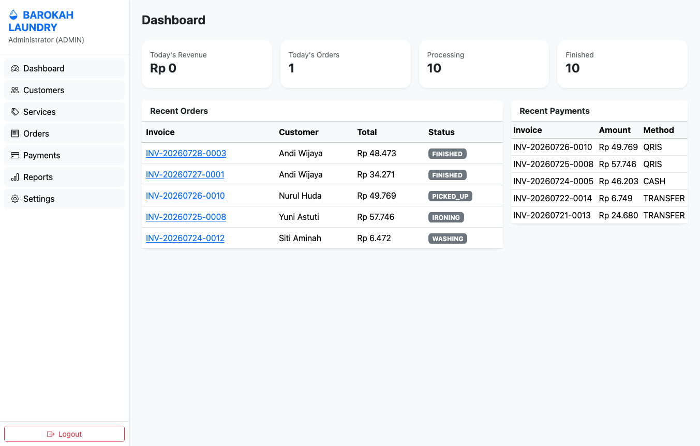
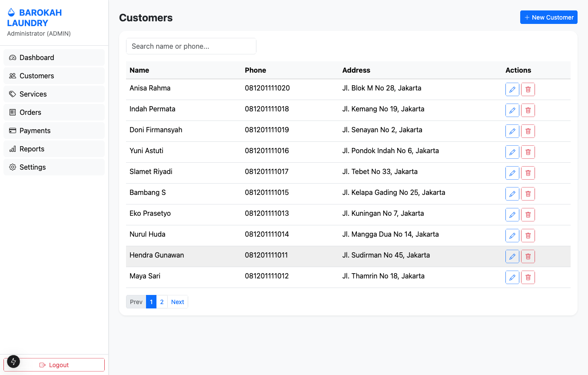
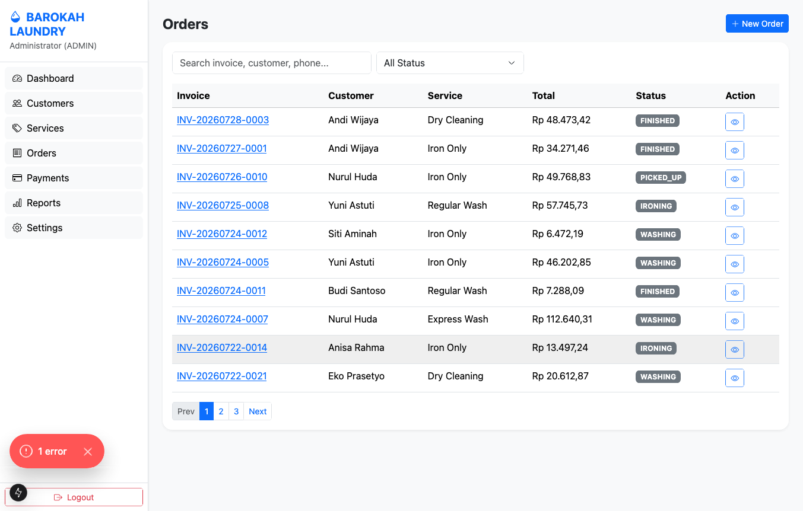
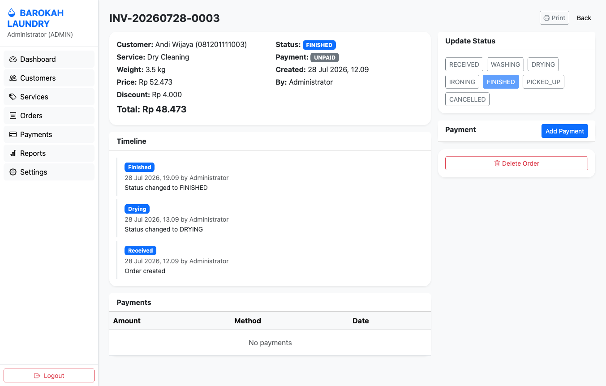
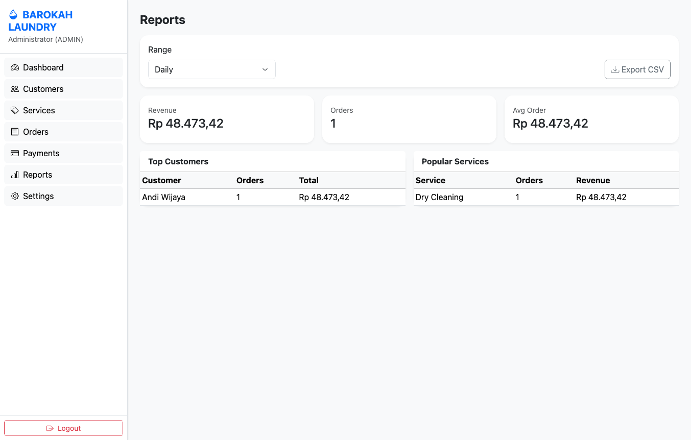

# Laundry Management System 🧺

Modern SaaS dashboard for single laundry business — simple, fast, production-ready. Built with Next.js 15 App Router + Prisma + SQLite.



**Live Demo**: `npm run dev` → http://localhost:3000

---

## 📦 System Info

| Layer        | Stack                                    |
|-------------|-------------------------------------------|
| Framework   | Next.js 15.1.6 (App Router)               |
| Language    | TypeScript Strict                         |
| UI          | Bootstrap 5.3 + Bootstrap Icons via CDN   |
| Database    | SQLite (file: `prisma/dev.db`)            |
| ORM         | Prisma 6                                  |
| Auth        | jose JWT (HS256) + bcryptjs session cookie|
| Validation  | Zod                                       |
| Package Mgr | npm                                       |
| Build       | `next build` → static + dynamic routes    |

**Requirements**: Node 18+, npm, no Docker needed

---

## 🏗 Project Flow

```
Login (/login) → middleware.ts checks JWT cookie "laundry_session"
  └─ unauthenticated → redirect /login
  └─ authenticated → (app) layout (sidebar + header)

(app) Protected Routes:
  /dashboard → today revenue, orders, processing/finished counts, recent orders/payments
  /customers → CRUD + search + pagination (10/page), unique phone enforcement
  /services  → CRUD + active/inactive toggle
  /orders    → CRUD, invoice INV-YYYYMMDD-0001 auto daily increment
             → status flow: RECEIVED > WASHING > DRYING > IRONING > FINISHED > PICKED_UP / CANCELLED
             → every status change creates OrderLog (vertical timeline)
             → /orders/[id] detail: timeline, payments, update status, add payment, print, soft delete
             → /orders/[id]/print → browser print (A4 + thermal 58/80mm compatible)
  /payments  → list all payments, auto updates Order.paymentStatus (UNPAID→DP→PAID)
  /reports   → Daily/Weekly/Monthly/Custom range, top customers, popular services, CSV export
  /settings  → laundry_name, address, phone, footer, receipt_note (key/value in DB) + backup

API:
  /api/auth/login (POST) → set httpOnly cookie
  /api/auth/logout (POST/GET) → clear cookie + redirect
  /api/customers CRUD (soft delete via deletedAt)
  /api/services CRUD
  /api/orders CRUD (auto calc price=service.pricePerKg*weight - discount, invoice gen, orderLogs)
  /api/payments CRUD + auto sum → paymentStatus
  /api/reports (GET ?range=daily|weekly|monthly|custom&from&to)
  /api/settings (GET/POST)
  /api/search (q= invoice | customer name | phone)
  /api/backup (POST) → copy dev.db → backup/YYYY-MM-DD.db

Security:
  - Password hash bcrypt 10 rounds
  - Secure httpOnly cookie, SameSite lax
  - Zod server-side validation on all inputs (never trust client)
  - escapeHtml util, friendly error messages (no stack trace exposed)
  - TransactionLogs immutable for audit (CREATE/UPDATE/DELETE attempts)
  - Soft delete everywhere (deletedAt)

DB Schema:
  users (id, username unique, password hash, name, role ADMIN|EMPLOYEE)
  customers (id, name, phone unique, address, notes, deletedAt, timestamps)
  services (id, name, pricePerKg, estimatedDays, description, isActive, deletedAt)
  orders (id, invoiceNumber unique, customerId FK, serviceId FK, weight, price, discount, total, paymentStatus UNPAID|DP|PAID, orderStatus RECEIVED..CANCELLED, createdById FK users, notes, deletedAt)
  payments (id, orderId FK, amount, method CASH|TRANSFER|QRIS, paidDate, paidById FK, notes)
  order_logs (id, orderId FK, status, description, createdById FK, createdAt)
  transaction_logs (id, action, entity, entityId, description, userId FK, createdAt)
  settings (id, key unique, value)
```

---

## 🚀 Cara Penggunaan

### 1. Install & Jalankan
```bash
cd LAUNDRY-1
npm install
npx prisma generate
npx prisma db push
npm run seed        # create admin/employee + services + 20 dummy customers + 25 orders
npm run dev         # http://localhost:3000
```

### 2. Login
- Buka http://localhost:3000 → auto redirect /login
- **Admin**: `admin` / `admin123` (full access)
- **Employee**: `employee` / `employee123`

### 3. Flow Harian (POS)
1. **Customer baru** → Customers → New Customer → isi nama + phone (unique) + alamat
2. **Buat Order** → Orders → New Order → pilih customer → pilih service (Regular 7000/kg, Express 12000/kg, dll) → isi weight kg → discount jika ada → Create
   - Invoice otomatis `INV-YYYYMMDD-0001` increment harian
   - Total auto: `pricePerKg * weight - discount`
3. **Proses Cucian** → buka detail order → klik status WASHING → DRYING → IRONING → FINISHED (tiap klik tercatat di Timeline)
4. **Pembayaran** → di detail order klik Add Payment → masukkan jumlah + method CASH/TRANSFER/QRIS
   - Jika bayar lunas → status jadi PAID, jika setengah → DP
5. **Pickup** → setelah customer ambil, set status PICKED_UP + Print invoice untuk struk
6. **Laporan** → Reports → pilih Daily/Weekly/Monthly atau Custom → Export CSV untuk akuntansi

### 4. Print Invoice
- `/orders/[id]/print` → Klik Print → Browser print dialog
- Format monospace simple, kompatibel:
  - A4 printer biasa
  - Thermal 58mm
  - Thermal 80mm

### 5. Backup
- Settings → Backup DB → file tersimpan di `backup/YYYY-MM-DD.db`
- Atau via CLI: `npm run backup`

### 6. Reset / Kosongkan Data
```bash
npx prisma db push --force-reset
npm run seed
```

Build production:
```bash
npm run build && npm start
```

---

## 📊 Dummy Data

Seed (`prisma/seed.ts`) sudah include:

- **2 Users**: admin (ADMIN), employee (EMPLOYEE)
- **5 Services**: Regular Wash, Express Wash, Iron Only, Dry Cleaning, Bed Cover Wash
- **20 Customers**: nama + phone `081201111001..020` + alamat Jakarta/Bandung/dll + notes (member, langganan, dll)
- **25 Orders**: random customer/service, weight 1-10kg, random status RECEIVED..PICKED_UP, payment status UNPAID/DP/PAID, invoice format hari-H, timeline OrderLog 1-3 entries, transaction logs
- **Payments**: auto generate untuk order dengan status DP/PAID (random CASH/TRANSFER/QRIS)
- **Settings**: laundry_name=Laundry Express, address, phone, footer, receipt_note

Untuk regenerate dummy data: hapus DB lalu seed ulang:
```bash
rm prisma/dev.db
npx prisma db push
npx tsx prisma/seed.ts
```

---

## 🖼️ Screenshots

| Dashboard | Customers |
|-----------|-----------|
|  |  |

| Orders | Order Detail + Timeline |
|--------|------------------------|
|  |  |

| Reports + CSV Export |
|---------------------|
|  |

> Screenshots diambil dari local dev dengan dummy data 20 customers + 25 orders. After seed, semua table ada isi.

---

## 📁 Struktur Folder
```
app/
  (app)/         # protected layout + dashboard/customers/services/orders/payments/reports/settings
  api/           # route handlers (auth/customers/services/orders/payments/reports/settings/search/backup)
  login/         # login page (client)
  layout.tsx     # root layout + Bootstrap CDN
components/      # EmptyState, SearchInput (debounce 400ms), Pagination
lib/
  db.ts          # singleton Prisma
  auth.ts        # hash, jwt create/verify, getSession, logTransaction
  validations.ts # zod schemas customer/service/order/payment/login
  utils.ts       # formatCurrency IDR, formatDate, generateInvoice, escapeHtml, colors
  constants.ts   # ITEMS_PER_PAGE, SETTING_KEYS
  backup.ts      # copy dev.db → backup/date.db
prisma/
  schema.prisma  # models + relations
  seed.ts        # seed + dummy data generator
  dev.db         # SQLite (gitignored)
public/
  screenshots/   # dashboard, customers, orders, order-detail, reports
middleware.ts    # auth guard (JWT cookie check)
.env.example     # DATABASE_URL + JWT_SECRET
```

---

## ✅ Features Checklist (from TASK.md)

- [x] Auth session + bcrypt + middleware redirect
- [x] Dashboard: today revenue/orders/processing/finished + recent
- [x] Customer CRUD + unique phone + search + pagination
- [x] Service CRUD + price/kg + est days + active flag
- [x] Order CRUD + INV-YYYYMMDD-0001 + auto price calc + status timeline
- [x] OrderLog timeline vertical + user + timestamp
- [x] Payment CASH/TRANSFER/QRIS + auto DP/PAID
- [x] TransactionLog immutable + soft delete everywhere
- [x] Reports daily/weekly/monthly/custom + top customers/services + CSV export
- [x] Global search invoice/customer/phone
- [x] Print A4/58mm/80mm browser print
- [x] Settings key/value + backup util
- [x] Zod server validation + friendly errors + loading spinner/disabled button states + empty states
- [x] Responsive: desktop first, tablet ok, mobile usable (Bootstrap grid)

---

## 🔧 Env
```
DATABASE_URL="file:./dev.db"
JWT_SECRET="laundry-super-secret-key-change-in-prod-2025"
```
Copy `.env.example` → `.env` if needed.

---

## 📄 License
**MarwahBahrun License** – see [LICENSE](./LICENSE)

Copyright (c) 2026 MarwahBahrun. Personal/internal use allowed with attribution retained. Commercial redistribution/resale requires permission.

```
Built with Laundry Management System by MarwahBahrun
https://github.com/kiembahrun99/laundry-management-system
```
